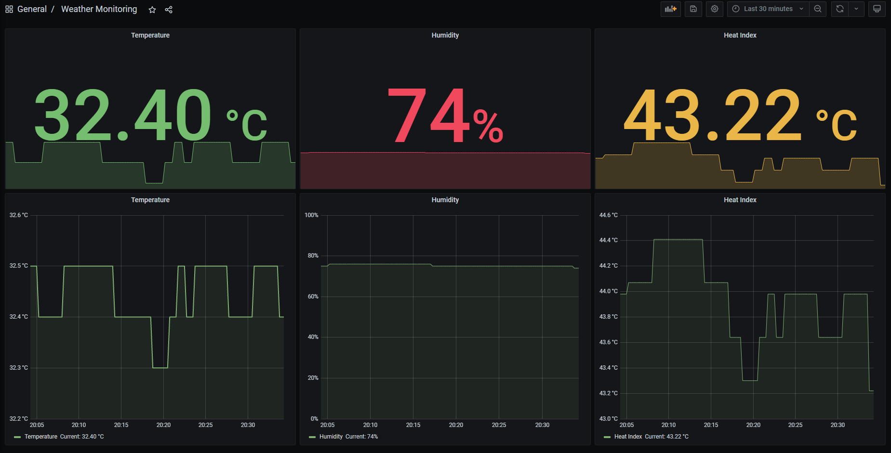

# Weather Monitoring with [NodeMcu + DHT11] as Weather Probe and [Prometheus + Grafana] Stack

This will contain the files used when:
- configuring **NodeMcu and DHT11** to send Temperature, Humidity, and Heat Index as HTTP Get Response.
- running a **Prometheus + Grafana** Stack to display the gathered metrics.

Pre-requisites:
- Docker and Docker Compose is installed in a Machine like Raspberry Pi or WSL.
- NodeMcu and DHT11 is configured like in the Circuit Diagram below.
- Arduino IDE, DHT11 library and NodeMcu CH340G driver is installed in the machine that will program the NodeMcu.
  ###### (*Links: [Arduino IDE](https://www.arduino.cc/en/guide/windows), [DHT11 library](https://randomnerdtutorials.com/complete-guide-for-dht11dht22-humidity-and-temperature-sensor-with-arduino/) and [NodeMcu CH340G driver](https://learn.sparkfun.com/tutorials/how-to-install-ch340-drivers/all#drivers-if-you-need-them)*)
- The environment is similar to the Topology below where the machines are reachable by each other.

Instructions:
1. Clone the repository and go to that directory.
   > git clone https://github.com/AceRodnel14/weather-monitoring.git
   > cd weather-monitoring
2. Edit [weather-probe.ino](./src/weather-probe/weather-probe.ino). Change the following things:
   - ssid (Line 9)
   - password (Line 10)
   - host_IP (Line 15)
   - subnet (Line 16)
   - gateway (Line 17)
   - host_name (Line 21) //optional
3. Copy [weather-probe.ino](./src/weather-probe/weather-probe.ino) and use Arduino IDE to upload the program to NodeMcu.
4. Clone the repository in the machine that has Docker and go to inside the directory.
   > git clone https://github.com/AceRodnel14/weather-monitoring.git
   > cd weather-monitoring
5. Edit the IP address for the weather-probe (Line 24) in [docker-compose.yml](./docker-compose.yml). Change it to the value of host_IP in step 2. 
   ###### (*Optional: you can change the admin user password by changing line 37 in [docker-compose.yml](./docker-compose.yml)*)
7. Run the containers using Docker Compose.
   > docker-compose up -d
8. After the containers start to run, wait for a while for Prometheus to get data from NodeMcu.
9. Go to your preferred browser and access Grafana (**\<IP address of machine with Docker\>:3000**).
10. Login using the credentials below:
    > user: admin
    > password: alphabeta (or the password you set)
11. After logging in, you can access the dashboard via the link below:
   ###### \<IP address of machine with Docker\>:3000/d/OTlMuCmgk/weather-monitoring

**Topology**

 
In this setup, 
1. The Raspberry Pi and NodeMcu belong to the **same network**.
   ###### (*Raspberry Pi can connect to the network via WiFi or wired connection. NodeMcu connects via WiFi.*)
2. The Raspberry Pi is just a host that can **run containers**.
   ###### (*Docker and Docker Compose is installed.*)
3. A DHT11 module is attached to the NodeMcu. This will get the **temperature, humidity, and heat index** and sends these as **HTTP Get response**.  
   ###### (*Please refer to the Circuit Diagram Below.*)

**Circuit Diagram**

 
- **NodeMcu + DHT11** is the usual circuit. DHT11 module is powered by 3.3V.
- There are scenarios where NodeMcu do not have enough power. **NodeMcu + DHT11 with External 5V Supply** will solve this insufficient power problem.
